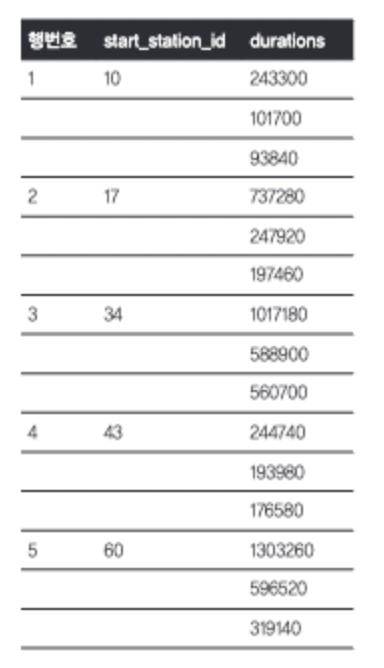

# 고급쿼리 문제풀이

* 활용할 데이터셋은 다음과 같습니다.

```googlesql
bigquery-public-data.london_bicycles.cycle_hire
```


* 각 대여소에서 가장 대여시간이 긴 3개의 행을 가져오기




* 날짜별로 직전 3개월과 이후 1달의 duration값의 평균 구하기

[https://dataonair.or.kr/db-tech-reference/d-lounge/expert-column/?mod=document\&uid=52209](https://dataonair.or.kr/db-tech-reference/d-lounge/expert-column/?mod=document\&uid=52209)


* 대여 건수가 가장 많은 20%의 자전거 대여 스테이션과 가장 적은 20%의 자전거 대여 스테이션 **ntile()**

```sql
WITH 대여_스테이션별_대여건수 AS (
  SELECT start_station_id, COUNT(*) AS 대여_건수
  FROM bigquery-public-data.london_bicycles.cycle_hire
  WHERE EXTRACT(YEAR FROM start_date) = 2019
  GROUP BY start_station_id
)

SELECT start_station_id, 대여_건수
FROM 대여_스테이션별_대여건수
WHERE NTILE(5) OVER(ORDER BY 대여_건수 DESC) = 1 -- 가장 많은 20%의 스테이션

UNION ALL

SELECT start_station_id, 대여_건수
FROM 대여_스테이션별_대여건수
WHERE NTILE(5) OVER(ORDER BY 대여_건수 ASC) = 1 -- 가장 적은 20%의 스테이션

```
